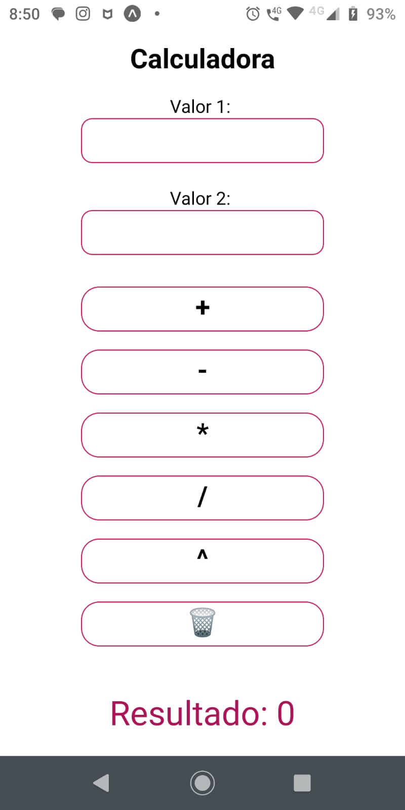

# FESA - 10-EC-ATIV1-Calculadora

## Descrição

Atividade da disciplina PROGRAMACAO MOBILE 2023.2

## Funcionalidades

Trata-se de uma simples calculadora, nela é possível:

- Somar
- Subtrair
- Dividir
- Fazer exponenciação

## Capturas de Tela

## Tecnologias Utilizadas

- React Native
- Expo

## Instalação

1. Clone este repositório: `git clone https://github.com/Yago-Caetano/Fesa_EC10_MOBILE_CALCULADORA.git`
2. Instale as dependências: `npm install` ou `yarn install`

## Como Usar

1. Inicie o aplicativo: `npm start` ou `yarn start` ou `npx expo-cli start`
2. Abra o app em um emulador ou dispositivo físico.
3. Explore as diferentes funcionalidades do aplicativo.

## Equipe

- Yago José Barros Caetano

